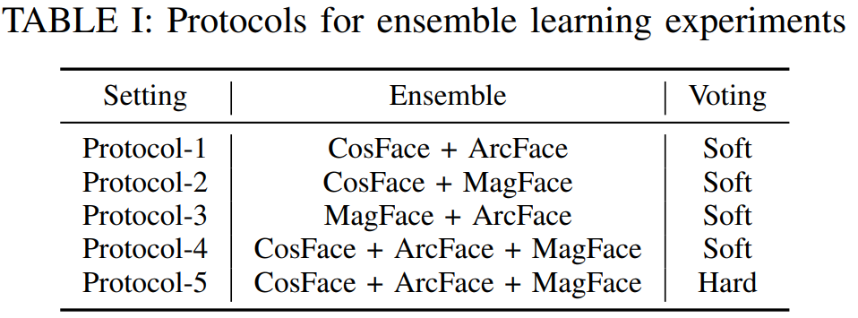
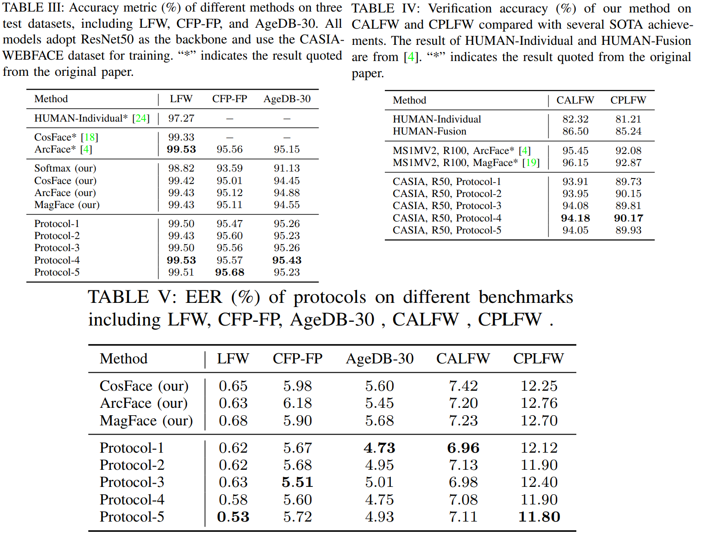
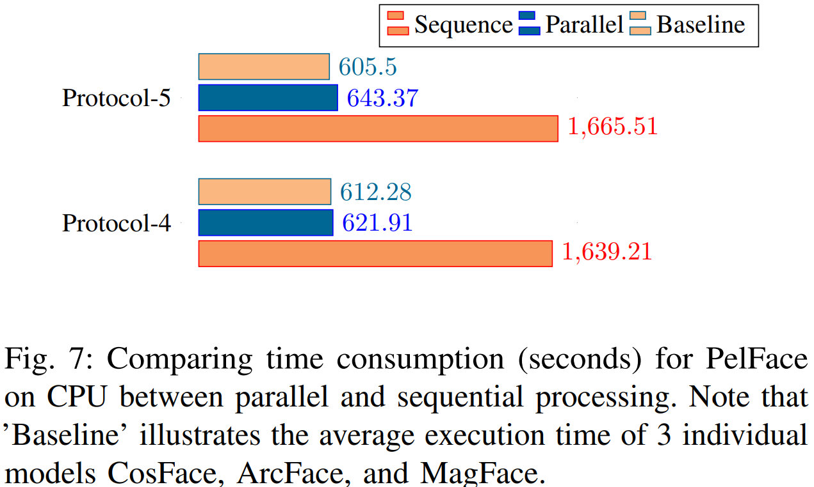

# PelFace

The *official* implementation for the ["**A Novel Deep Ensemble Learning to Enhance User Authentication in Autonomous Vehicles**"](10.1109/TASE.2023.3270764) -- which is accepted in IEEE Transactions on Automation Science and Engineering (2023)

>We firstly investigate and analyzes the effect of several effective loss functions based on softmax on DCNN with the ResNet architecture. 
>We then propose a parallel ensemble learning, namely PelFace, by taking advantage of recent novel face recognition methods: CosFace, ArcFace, and MagFace. 
>PelFace elaborates on the voting mechanism that utilizes non-optimal pre-trained models to obtain better discriminative ability for face recognition. 
>In addition, we propose to perform the matching phase for each PelFace model in parallel. The results of our experiments achieve state-of-the-art figures, which show the proposed method’s massive
potential in improving face recognition performance. 

# What's New
<!-- which is accepted by [conf]()
#### [Mon. DDth, YYYY]
+ We make the repo public available.

-->


# Getting Started

## Installation
``` python
git clone https://github.com/ewigspace1910/PelFace.git
cd PelFace
pip install -r requirements.txt

```

## Prepare Datasets
- We use CASIA-Webface  for training and some available test sets including LFW, CFP-FP, AgeDB, CALFW, CPLFW for benchmark. 
All datasets is contributed from [Insightface](https://github.com/deepinsight/insightface/tree/master/recognition/_datasets_)

- Download and extract into _data_ folder. Please unzip data and prepare like

```
PelFace/data
├── casia-webface
│   └── 00000
│   └── 00001
│   └...
├── lfw
│   └── 00001.jpg
│   └...
├── cfp_fp
│   └── 00001.jpg
│   └...
├── ...
│
├── images_lists.txt
├── lfw_pair.txt
├── cfp_fp_pair.txt
└── ...
```

## Training 

- We re-implement ArcFace, CosFace and MagFace on 1 Tesla T4 GPU. We use 112x112 sized images  and adopt only resnet50 architecture(with BN-Dropout-FC-BN header) for training. 
Because of 16G GPU Ram, we set batch size to 128.

    ```python
    bash script/train.sh
    ```

- Tips for training:
     - 	Early on, We tried training model from scratch with ArcFace, but diverged after some epoch. Since the embedding size is smaller than 512. If u want try with smaller embeds(128, 64,...), u should use Pre trained model then finetune before train it.
     -  If can't use large batch size(>128), we should use small learning rate. In paper, we use 0.025 for inital LR instead of 0.1

## Evaluation
In this stage, we will conduct an ensemble from trained models by Voting mechanism. Then, we apply parallel processing to the inference processing of the ensemble. 

1. Evaluate the effectiveness of Ensemble.

    - Test the individual trained model (optional):

    ```python
    python examples/test.py --c configs/softmax.yaml --p ./save/softmax/ckpt/checkpoint.pth
    ```

    - Test the Ensemble: 

    ```python
    bash script/test_ensemble.sh
    ```

2. Evaluate the effectiveness of parallel processing.

    - Test performance of parallel processing:

    ```python
    bash script/test_parallel.sh
    ```

## Reported Results
- We setup 5 ensemble protocol: 



- The reported results of 5 protocols are listed below.



- The comparison between parallel and sequential processing




# Citation
```

```

